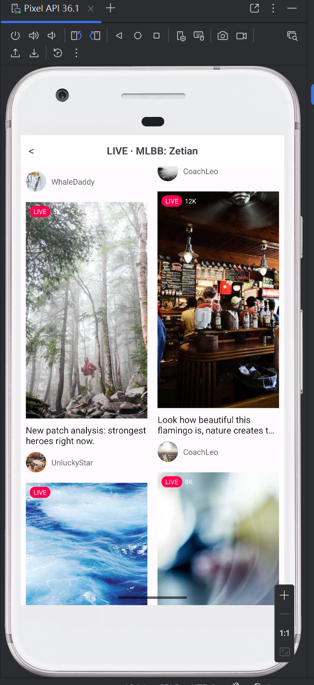

# TikTok Video Feed Demo (Android / Java)

本项目为 **客户端训练营 - 作业一：TikTok 游戏短视频流 Demo**  
实现了类似 TikTok / 抖音的游戏短视频流展示功能，包括瀑布流页面、分页加载、网络图片加载、视频播放与横竖屏不断流体验等。

---

## ✨ 功能特性（Features）

### 🎥 1. 瀑布流视频列表（StaggeredGrid Layout）
- 双列瀑布流布局
- 每个卡片包含：
    - 封面图（cover）
    - LIVE 标签
    - 观看人数 viewerCount
    - 标题 title
    - 作者头像 avatar
    - 作者昵称 nickname
- 使用 Glide 加载远程网络图片（含缓存与占位图）

### 📡 2. 分页加载（Paging）
- 首屏加载 50 条数据
- 当滑动到列表底部附近时自动加载下一页
- ViewModel + Repository 解耦数据与 UI
- 模拟真实线上接口的分页行为（可进一步接入后台）

### 🖼 3. 网络图片加载（Network Images）
- 封面和头像均通过 Glide 从网络加载
- 使用占位图、内存缓存、磁盘缓存提升滑动流畅度
- 大量 mock 数据模拟高流量场景

### ▶️ 4. 视频播放页（VideoPlayerActivity）
- 点击卡片跳转至播放详情页
- 使用 **ExoPlayer** 播放网络 `mp4` 视频
- 支持：
    - 自动播放
    - 控制栏（暂停、进度条）
    - 缓冲状态显示（`show_buffering`）
    - 播放器 UI 自适配

### 📱 5. 横竖屏切换播放不中断
- 默认情况下，横屏会重建 Activity 导致 ExoPlayer 被销毁
- 本项目通过 Manifest 中声明：

``` 
  android:configChanges="orientation|screenSize|keyboardHidden"
```
接管配置变更，避免系统重建 Activity

* 横竖屏切换时播放器实例未被销毁，进度不丢失

### 📦 6. 数据层设计与扩展（Repository）

* 使用 Repository 统一管理数据来源
* 当前使用本地 mock 数据模拟视频列表
* Repository 对上暴露分页接口，后续可扩展接入：

    * Retrofit + JSON/REST API
    * Room/SQLite 本地缓存
    * 混合数据源（网络优先，本地兜底）

---

## 🏛 架构设计（Architecture）

本项目采用 **MVVM + Repository** 轻量级架构，满足解耦、可扩展、易维护的特点。

```
UI 层（Activity / Fragment）
        ↓ 观察 LiveData
ViewModel（VideoListViewModel）
        ↓ 调用
Repository（VideoRepository）
        ↓ 获取数据
数据源（mock / 网络）
```

---

## 📂 项目结构（Project Structure）

```
app/src/main/java/com/example/tiktokvideoapp
│
├── model/                # 数据模型（VideoItem）
│
├── network/              #（预留）未来放 Retrofit 接口
│
├── repository/           # 数据仓库（分页逻辑 + mock 数据）
│   └── VideoRepository.java
│
├── ui/
│   ├── main/             # 首页推荐流
│   │   ├── MainActivity.java
│   │   ├── VideoListFragment.java
│   │   └── adapter/
│   │       └── VideoListAdapter.java
│   │
│   └── player/           # 视频播放页面
│       └── VideoPlayerActivity.java
│
└── util/                 # 工具类（如 Glide 扩展等）
```

---

## 🔧 技术栈（Tech Stack）

| 技术                         | 用途        |
| -------------------------- | --------- |
| Java + Android View        | 主体界面开发    |
| MVVM（ViewModel + LiveData） | 解耦 UI 与数据 |
| Repository Pattern         | 灵活切换数据源   |
| RecyclerView               | 列表渲染（瀑布流） |
| StaggeredGridLayoutManager | 横向双列卡片    |
| Glide                      | 网络图片加载与缓存 |
| ExoPlayer                  | 网络视频播放    |
| Manifest configChanges     | 横竖屏不断流处理  |

---

## 🚀 运行方式（How to Run）

1. 克隆项目：

   ```bash
   https://github.com/LovienWee/ByteDanceCourseDesign1-TiktokVideoApp.git
   ```
2. 使用 Android Studio 打开项目
3. 连接模拟器或真机
4. 点击 Run（▶）

功能体验：

* 滑动查看瀑布流视频列表
* 点击任意卡片进入网络视频播放页面
* 横竖屏切换，视频保持继续播放

---

## 📷 截图展示（Screenshots）



---

## 🐛 关键问题与解决方案（Debug Notes）

### 1. 图片加载延迟 / 空白闪烁

**原因**：大量网络图片 + 模拟器网络较慢

**解决**：分页、Glide 缓存、占位图、RecyclerView 缓存调优

### 2. VideoView 无法播放网络视频

**原因**：VideoView 内部使用 ContentResolver 解析网络 URI（该方法读取在线视频已废弃）

**解决**：切换到 ExoPlayer（工业级播放器）

### 3. 横竖屏切换视频重头播放

**原因**：Activity 重建导致 ExoPlayer 被销毁

**解决**：在 Manifest 中接管配置变更
`android:configChanges="orientation|screenSize|keyboardHidden"`

---

## ✍️ 项目总结（Conclusion）

本项目完整实现：

* 短视频推荐流列表
* Glide 网络图片加载
* MVVM 架构 + Repository
* 分页加载
* 网络视频播放（ExoPlayer）
* 横竖屏不断流体验

---

## 🧭 后续扩展方向（Future Work）

* 接入真实服务端接口（Retrofit + Gson）
* 本地缓存（Room / SQLite）
* 下拉刷新
* 视频评论页等其他页面
* 多分辨率切换、倍速播放
* 小窗播放（PiP）

---

## 📄 License

Copyright © 2025 LovienWee.

本项目采用 **GPL v3** 开源协议。

这意味着你可以自由使用、修改和分发本软件，但任何基于本项目的衍生作品也必须以相同的开源方式发布。

详见 [LICENSE](LICENSE) 文件。